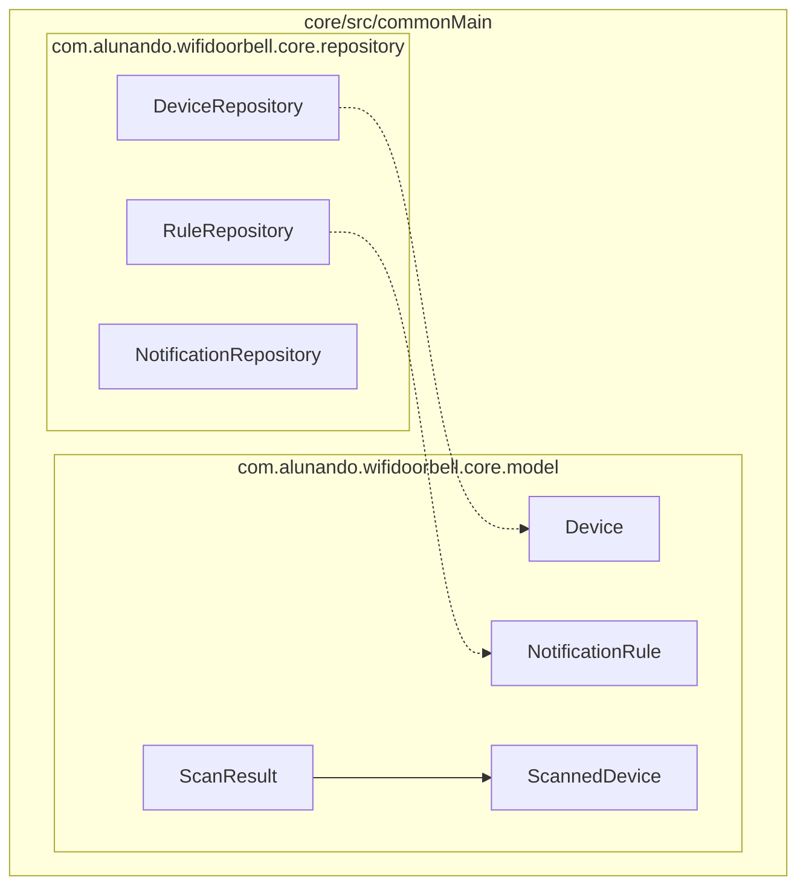

# Issue 4 Implementation Plan

> **For agentic workers:** REQUIRED SUB-SKILL: Use superpowers:subagent-driven-development to implement this plan task-by-task. Steps use checkbox (`- [ ]`) syntax for tracking.

**Goal:** Create the core domain models (`Device`, `NotificationRule`, `ScannedDevice`, `ScanResult`) and repository interfaces in the Kotlin Multiplatform `core` module.

**Architecture:** We are using Kotlin Data Classes annotated with `@Serializable` for the domain models, and standard Kotlin interfaces with `suspend` and `Flow` for the repository contracts. This ensures the models are ready for local caching (SQLDelight) and remote syncing (Firestore) in future issues.

**Architecture Diagram:**



**Tech Stack:** Kotlin Multiplatform, `kotlinx.serialization`, Coroutines (`Flow`).

**Spec:** [Issue 4 Spec](file:///c:/Users/valdir/Documents/dev/android/wifi-doorbell/docs/superpowers/specs/2026-09-27-issue-4-core-models-design.md)

## Global Constraints

- Module path: `core/src/commonMain/kotlin`
- Package: `com.alunando.wifidoorbell.core.model` and `com.alunando.wifidoorbell.core.repository`
- All tests must pass: `./gradlew :core:test`

---

### Task 1: Setup Serialization

**Files:**
- Modify: `gradle/libs.versions.toml`
- Modify: `core/build.gradle.kts`

**Interfaces:**
- Consumes: N/A
- Produces: Build environment with `kotlinx.serialization` available.

- [ ] **Step 1: Add dependencies to TOML**

Add the serialization plugin and library to `gradle/libs.versions.toml`:
```toml
[plugins]
# Add this under existing plugins
kotlin-serialization = { id = "org.jetbrains.kotlin.plugin.serialization", version.ref = "kotlin" }

[libraries]
# Add this under existing libraries
kotlinx-serialization-json = { module = "org.jetbrains.kotlinx:kotlinx-serialization-json", version = "1.6.3" }
```
*(Assume version 1.6.3 or compatible with current kotlin version)*

- [ ] **Step 2: Apply plugin in core**

In `core/build.gradle.kts`, add the plugin alias and dependency:
```kotlin
plugins {
    // existing plugins...
    alias(libs.plugins.kotlin.serialization)
}

kotlin {
    sourceSets {
        commonMain.dependencies {
            // existing dependencies...
            implementation(libs.kotlinx.serialization.json)
        }
    }
}
```

- [ ] **Step 3: Verify build**

Run: `./gradlew :core:assemble`
Expected: PASS

- [ ] **Step 4: Commit**

```bash
git add gradle/libs.versions.toml core/build.gradle.kts
git commit -m "build(core): adiciona kotlinx.serialization"
```

---

### Task 2: Models and Tests (Part 1)

**Files:**
- Create: `core/src/commonMain/kotlin/com/alunando/wifidoorbell/core/model/Device.kt`
- Create: `core/src/commonMain/kotlin/com/alunando/wifidoorbell/core/model/NotificationRule.kt`
- Create: `core/src/commonTest/kotlin/com/alunando/wifidoorbell/core/model/NotificationRuleTest.kt`

**Interfaces:**
- Produces: `Device`, `NotificationRule` data classes.

- [ ] **Step 1: Write serialization test**

Create `core/src/commonTest/kotlin/com/alunando/wifidoorbell/core/model/NotificationRuleTest.kt`:
```kotlin
package com.alunando.wifidoorbell.core.model

import kotlinx.serialization.json.Json
import kotlin.test.Test
import kotlin.test.assertEquals

class NotificationRuleTest {
    @Test
    fun testSerialization() {
        val rule = NotificationRule("AA:BB:CC:DD:EE:FF", 30, true, 123456789L)
        val jsonString = Json.encodeToString(NotificationRule.serializer(), rule)
        val decoded = Json.decodeFromString(NotificationRule.serializer(), jsonString)
        assertEquals(rule, decoded)
    }
}
```

- [ ] **Step 2: Run test (fails)**

Run: `./gradlew :core:test`
Expected: Compilation failure or Test failure (classes do not exist).

- [ ] **Step 3: Implement data classes**

Create `Device.kt`:
```kotlin
package com.alunando.wifidoorbell.core.model

import kotlinx.serialization.Serializable

@Serializable
data class Device(
    val mac: String,
    val ip: String,
    val customName: String?,
    val manufacturer: String?,
    val isWatched: Boolean,
    val lastSeen: Long,
    val firstSeen: Long
)
```

Create `NotificationRule.kt`:
```kotlin
package com.alunando.wifidoorbell.core.model

import kotlinx.serialization.Serializable

@Serializable
data class NotificationRule(
    val mac: String,
    val throttleMinutes: Int,
    val enabled: Boolean,
    val lastNotifiedAt: Long?
)
```

- [ ] **Step 4: Verify test passes**

Run: `./gradlew :core:test`
Expected: PASS

- [ ] **Step 5: Commit**

```bash
git add core/src/commonMain/kotlin/com/alunando/wifidoorbell/core/model/Device.kt core/src/commonMain/kotlin/com/alunando/wifidoorbell/core/model/NotificationRule.kt core/src/commonTest/kotlin/com/alunando/wifidoorbell/core/model/NotificationRuleTest.kt
git commit -m "feat(core): adiciona modelos Device e NotificationRule"
```

---

### Task 3: Models and Tests (Part 2)

**Files:**
- Create: `core/src/commonMain/kotlin/com/alunando/wifidoorbell/core/model/ScannedDevice.kt`
- Create: `core/src/commonMain/kotlin/com/alunando/wifidoorbell/core/model/ScanResult.kt`
- Create: `core/src/commonTest/kotlin/com/alunando/wifidoorbell/core/model/ScanResultTest.kt`

**Interfaces:**
- Produces: `ScannedDevice`, `ScanResult` data classes.

- [ ] **Step 1: Write equality and serialization test**

Create `core/src/commonTest/kotlin/com/alunando/wifidoorbell/core/model/ScanResultTest.kt`:
```kotlin
package com.alunando.wifidoorbell.core.model

import kotlinx.serialization.json.Json
import kotlin.test.Test
import kotlin.test.assertEquals
import kotlin.test.assertNotEquals

class ScanResultTest {
    @Test
    fun testSerializationAndEquality() {
        val dev1 = ScannedDevice("192.168.1.5", "AA:BB")
        val result1 = ScanResult(1000L, listOf(dev1))
        val result2 = ScanResult(1000L, listOf(dev1))
        val result3 = ScanResult(2000L, listOf(dev1))

        assertEquals(result1, result2)
        assertNotEquals(result1, result3)

        val jsonString = Json.encodeToString(ScanResult.serializer(), result1)
        val decoded = Json.decodeFromString(ScanResult.serializer(), jsonString)
        assertEquals(result1, decoded)
    }
}
```

- [ ] **Step 2: Run test (fails)**

Run: `./gradlew :core:test`
Expected: Compilation failure (classes do not exist).

- [ ] **Step 3: Implement data classes**

Create `ScannedDevice.kt`:
```kotlin
package com.alunando.wifidoorbell.core.model

import kotlinx.serialization.Serializable

@Serializable
data class ScannedDevice(
    val ip: String,
    val mac: String
)
```

Create `ScanResult.kt`:
```kotlin
package com.alunando.wifidoorbell.core.model

import kotlinx.serialization.Serializable

@Serializable
data class ScanResult(
    val timestamp: Long,
    val devices: List<ScannedDevice>
)
```

- [ ] **Step 4: Verify test passes**

Run: `./gradlew :core:test`
Expected: PASS

- [ ] **Step 5: Commit**

```bash
git add core/src/commonMain/kotlin/com/alunando/wifidoorbell/core/model/ScannedDevice.kt core/src/commonMain/kotlin/com/alunando/wifidoorbell/core/model/ScanResult.kt core/src/commonTest/kotlin/com/alunando/wifidoorbell/core/model/ScanResultTest.kt
git commit -m "feat(core): adiciona modelos ScannedDevice e ScanResult"
```

---

### Task 4: Repository Interfaces

**Files:**
- Create: `core/src/commonMain/kotlin/com/alunando/wifidoorbell/core/repository/DeviceRepository.kt`
- Create: `core/src/commonMain/kotlin/com/alunando/wifidoorbell/core/repository/RuleRepository.kt`
- Create: `core/src/commonMain/kotlin/com/alunando/wifidoorbell/core/repository/NotificationRepository.kt`

**Interfaces:**
- Consumes: `Device`, `NotificationRule`
- Produces: `DeviceRepository`, `RuleRepository`, `NotificationRepository` interfaces.

- [ ] **Step 1: Create repository interfaces**

Since these are just interfaces, no tests are needed yet. Implement them directly.

Create `DeviceRepository.kt`:
```kotlin
package com.alunando.wifidoorbell.core.repository

import com.alunando.wifidoorbell.core.model.Device
import kotlinx.coroutines.flow.Flow

interface DeviceRepository {
    fun getWatchedDevices(): Flow<List<Device>>
    suspend fun saveDevice(device: Device)
}
```

Create `RuleRepository.kt`:
```kotlin
package com.alunando.wifidoorbell.core.repository

import com.alunando.wifidoorbell.core.model.NotificationRule

interface RuleRepository {
    suspend fun getRuleFor(mac: String): NotificationRule?
    suspend fun updateRule(rule: NotificationRule)
}
```

Create `NotificationRepository.kt`:
```kotlin
package com.alunando.wifidoorbell.core.repository

interface NotificationRepository {
    suspend fun sendNotification(title: String, body: String)
}
```

- [ ] **Step 2: Verify compilation**

Run: `./gradlew :core:assemble`
Expected: PASS

- [ ] **Step 3: Commit**

```bash
git add core/src/commonMain/kotlin/com/alunando/wifidoorbell/core/repository/*.kt
git commit -m "feat(core): adiciona interfaces de repositório"
```
