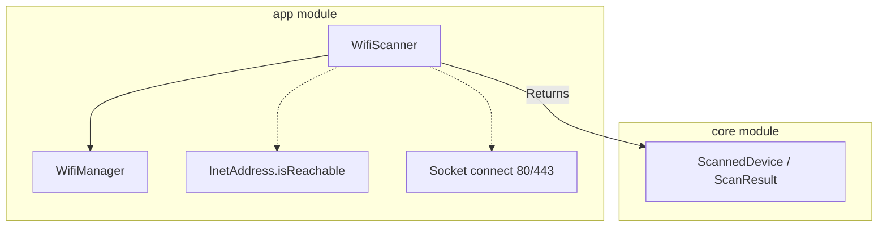

# Issue 8 Implementation Plan

> **For agentic workers:** REQUIRED SUB-SKILL: Use superpowers:subagent-driven-development to implement this plan task-by-task. Steps use checkbox (`- [ ]`) syntax for tracking.

**Goal:** Refactor the existing models to use Hostname instead of MAC address, and implement the core `WifiScanner` component that sweeps the local network.

**Architecture:** 
1. The domain models (`Device`, `NotificationRule`, `ScannedDevice`) will drop the `mac` and `manufacturer` fields, replacing them with `id` and `hostname`.
2. The `WifiScanner` will run inside the Android `app` module. It uses `WifiManager` to determine the local subnet and launches parallel coroutines to sweep all 254 IPs using ICMP ping with a TCP port 80/443 fallback. The responding IPs are mapped to hostnames via `InetAddress.canonicalHostName`.

**Architecture Diagram:**



**Tech Stack:** Kotlin, Coroutines (`Dispatchers.IO`), Android `WifiManager`, `java.net.InetAddress`, `java.net.Socket`.

**Spec:** [Issue 8 Spec](file:///c:/Users/valdir/Documents/dev/android/wifi-doorbell/docs/superpowers/specs/2026-09-27-issue-8-wifi-scanner-design.md)

## Global Constraints

- Android `WifiScanner` belongs in `com.alunando.wifidoorbell.scanner`.
- Models are located in `core/src/commonMain/kotlin/com/alunando/wifidoorbell/core/model`.
- Subnet mask and IP bitwise operations must correctly handle Java's signed byte/int conversions.

---

### Task 1: Refactor Core Models

**Files:**
- Modify: `core/src/commonMain/kotlin/com/alunando/wifidoorbell/core/model/Device.kt`
- Modify: `core/src/commonMain/kotlin/com/alunando/wifidoorbell/core/model/NotificationRule.kt`
- Modify: `core/src/commonMain/kotlin/com/alunando/wifidoorbell/core/model/ScannedDevice.kt`
- Modify: `core/src/commonTest/kotlin/com/alunando/wifidoorbell/core/model/NotificationRuleTest.kt`
- Modify: `core/src/commonTest/kotlin/com/alunando/wifidoorbell/core/model/ScanResultTest.kt`
- Modify: `core/src/commonMain/kotlin/com/alunando/wifidoorbell/core/repository/RuleRepository.kt`

**Interfaces:**
- Produces: Updated `Device`, `NotificationRule`, and `ScannedDevice` classes using `id` and `hostname`.

- [ ] **Step 1: Update Device and ScannedDevice**

Modify `Device.kt`:
```kotlin
package com.alunando.wifidoorbell.core.model
import kotlinx.serialization.Serializable

@Serializable
data class Device(
    val id: String,
    val hostname: String,
    val ip: String,
    val customName: String?,
    val isWatched: Boolean,
    val lastSeen: Long,
    val firstSeen: Long
)
```

Modify `ScannedDevice.kt`:
```kotlin
package com.alunando.wifidoorbell.core.model
import kotlinx.serialization.Serializable

@Serializable
data class ScannedDevice(
    val id: String,
    val hostname: String,
    val ip: String
)
```

- [ ] **Step 2: Update NotificationRule and RuleRepository**

Modify `NotificationRule.kt`:
```kotlin
package com.alunando.wifidoorbell.core.model
import kotlinx.serialization.Serializable

@Serializable
data class NotificationRule(
    val id: String,
    val throttleMinutes: Int,
    val enabled: Boolean,
    val lastNotifiedAt: Long?
)
```

Modify `RuleRepository.kt` (replace `mac` with `id`):
```kotlin
package com.alunando.wifidoorbell.core.repository
import com.alunando.wifidoorbell.core.model.NotificationRule

interface RuleRepository {
    suspend fun getRuleFor(id: String): NotificationRule?
    suspend fun updateRule(rule: NotificationRule)
}
```

- [ ] **Step 3: Update Tests**

Update `NotificationRuleTest.kt`:
Change `val rule = NotificationRule("AA:BB:CC:DD:EE:FF", 30, true, 123456789L)` to `val rule = NotificationRule("device-id-123", 30, true, 123456789L)`.

Update `ScanResultTest.kt`:
Change `val dev1 = ScannedDevice("192.168.1.5", "AA:BB")` to `val dev1 = ScannedDevice("device-id-123", "John-iPhone", "192.168.1.5")`.

- [ ] **Step 4: Verify build and tests**

Run: `./gradlew :core:test`
Expected: PASS

- [ ] **Step 5: Commit**

```bash
git add core/
git commit -m "refactor(core): substitui mac por id e adiciona hostname nos modelos"
```

---

### Task 2: Subnet Utilities

**Files:**
- Create: `app/src/main/java/com/alunando/wifidoorbell/scanner/SubnetUtils.kt`

**Interfaces:**
- Produces: `SubnetUtils.getIpsInSubnet(ipAddress: Int, netmask: Int): List<String>`

- [ ] **Step 1: Write utility functions**

Create `SubnetUtils.kt`:
```kotlin
package com.alunando.wifidoorbell.scanner

object SubnetUtils {
    /**
     * Given an IP address and a netmask (both in network byte order as returned by DhcpInfo),
     * returns a list of all IP addresses in the subnet (excluding network and broadcast).
     */
    fun getIpsInSubnet(ipAddress: Int, netmask: Int): List<String> {
        if (netmask == 0) return emptyList()
        
        val networkAddress = ipAddress and netmask
        val invertedNetmask = netmask.inv()
        val numHosts = invertedNetmask - 1
        
        if (numHosts <= 0) return emptyList()
        
        val ips = mutableListOf<String>()
        // Exclude 0 (network) and invertedNetmask (broadcast)
        for (i in 1..numHosts) {
            val hostAddress = networkAddress or i
            ips.add(intToIp(hostAddress))
        }
        return ips
    }

    private fun intToIp(i: Int): String {
        return "${i and 0xFF}.${(i shr 8) and 0xFF}.${(i shr 16) and 0xFF}.${(i shr 24) and 0xFF}"
    }
}
```

- [ ] **Step 2: Commit**

```bash
git add app/src/main/java/com/alunando/wifidoorbell/scanner/SubnetUtils.kt
git commit -m "feat(app): adiciona SubnetUtils para calculo de ips"
```

---

### Task 3: WifiScanner Component

**Files:**
- Create: `app/src/main/java/com/alunando/wifidoorbell/scanner/WifiScanner.kt`

**Interfaces:**
- Consumes: `SubnetUtils`, `ScanResult`, `ScannedDevice`
- Produces: `class WifiScanner`

- [ ] **Step 1: Write WifiScanner class**

Create `WifiScanner.kt`:
```kotlin
package com.alunando.wifidoorbell.scanner

import android.content.Context
import android.net.wifi.WifiManager
import com.alunando.wifidoorbell.core.model.ScanResult
import com.alunando.wifidoorbell.core.model.ScannedDevice
import kotlinx.coroutines.Dispatchers
import kotlinx.coroutines.async
import kotlinx.coroutines.awaitAll
import kotlinx.coroutines.withContext
import java.net.InetAddress
import java.net.InetSocketAddress
import java.net.Socket
import java.security.MessageDigest

class WifiScanner(private val context: Context) {

    suspend fun scan(): ScanResult = withContext(Dispatchers.IO) {
        val wifiManager = context.applicationContext.getSystemService(Context.WIFI_SERVICE) as WifiManager
        val dhcpInfo = wifiManager.dhcpInfo
        
        if (dhcpInfo == null || dhcpInfo.ipAddress == 0) {
            return@withContext ScanResult(System.currentTimeMillis(), emptyList())
        }

        val ips = SubnetUtils.getIpsInSubnet(dhcpInfo.ipAddress, dhcpInfo.netmask)
        
        val scannedDevices = ips.map { ip ->
            async { pingAndResolve(ip) }
        }.awaitAll().filterNotNull()

        ScanResult(System.currentTimeMillis(), scannedDevices)
    }

    private fun pingAndResolve(ip: String): ScannedDevice? {
        return try {
            val inetAddress = InetAddress.getByName(ip)
            val isReachable = inetAddress.isReachable(200) || tryTcpConnect(ip, 80) || tryTcpConnect(ip, 443)
            
            if (isReachable) {
                val hostname = inetAddress.canonicalHostName.takeIf { it != ip } ?: "Unknown Device"
                val id = hashString(hostname + ip) // Use IP in hash to avoid collisions if hostname is Unknown
                ScannedDevice(id = id, hostname = hostname, ip = ip)
            } else {
                null
            }
        } catch (e: Exception) {
            null
        }
    }

    private fun tryTcpConnect(ip: String, port: Int): Boolean {
        return try {
            Socket().use { socket ->
                socket.connect(InetSocketAddress(ip, port), 200)
                true
            }
        } catch (e: Exception) {
            false
        }
    }

    private fun hashString(input: String): String {
        val bytes = MessageDigest.getInstance("SHA-256").digest(input.toByteArray())
        return bytes.joinToString("") { "%02x".format(it) }.take(16)
    }
}
```

- [ ] **Step 2: Commit**

```bash
git add app/src/main/java/com/alunando/wifidoorbell/scanner/WifiScanner.kt
git commit -m "feat(app): implementa WifiScanner com ping sweep paralelo"
```
