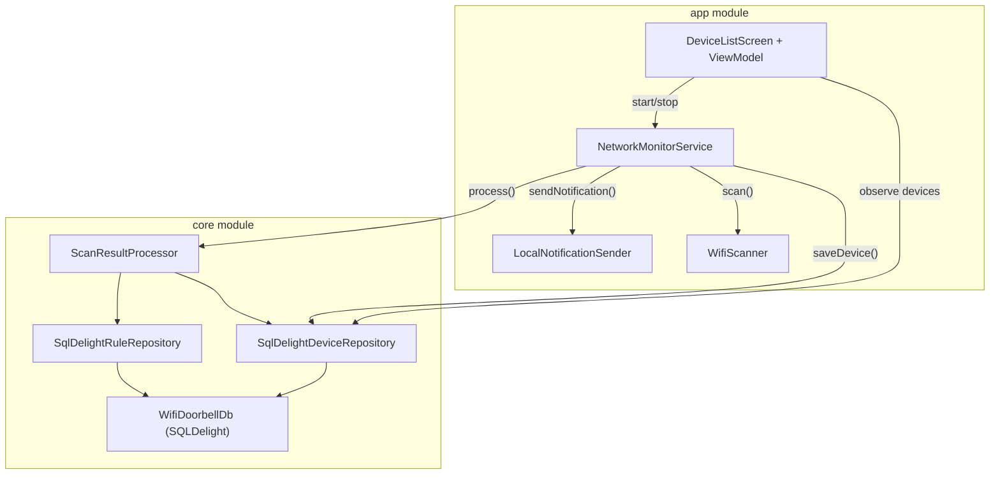

# MVP Implementation Plan

> **For agentic workers:** REQUIRED SUB-SKILL: Use superpowers:subagent-driven-development to implement this plan task-by-task. Steps use checkbox (`- [ ]`) syntax for tracking.

**Goal:** Wire up all existing components (models, WifiScanner, ScanResultProcessor) into a working end-to-end app with SQLDelight persistence, local notifications, a foreground service scan loop, and a single-screen UI.

**Architecture:** The app module hosts the UI, Service, and Notification sender. The core module hosts the SQLDelight database, concrete repository implementations, and all domain models. The Service runs a 30-second scan loop that feeds results through the processor and dispatches local notifications for newly detected watched devices.

**Architecture Diagram:**



**Tech Stack:** Kotlin, Jetpack Compose, Coroutines, SQLDelight 2.1.0, Android NotificationManager, Foreground Service.

**Spec:** [MVP Design Spec](file:///c:/Users/valdir/Documents/dev/android/wifi-doorbell/docs/superpowers/specs/2026-09-27-mvp-design.md)

## Global Constraints

- Package: `com.alunando.wifidoorbell` (app), `com.alunando.wifidoorbell.core` (core)
- `minSdk = 26`, `targetSdk = 35`
- SQLDelight database name: `WifiDoorbellDb`, package: `com.alunando.wifidoorbell.core.db`
- No dependency injection framework — manual wiring via factory pattern
- `.sq` files go in `core/src/commonMain/sqldelight/com/alunando/wifidoorbell/core/db/`

---

### Task 1: SQLDelight Schema Files

**Files:**
- Create: `core/src/commonMain/sqldelight/com/alunando/wifidoorbell/core/db/Device.sq`
- Create: `core/src/commonMain/sqldelight/com/alunando/wifidoorbell/core/db/NotificationRule.sq`

**Interfaces:**
- Produces: SQLDelight-generated `DeviceEntityQueries` and `NotificationRuleEntityQueries` classes

- [ ] **Step 1: Create Device.sq**

Create `core/src/commonMain/sqldelight/com/alunando/wifidoorbell/core/db/Device.sq`:
```sql
CREATE TABLE DeviceEntity (
  id TEXT PRIMARY KEY,
  hostname TEXT NOT NULL,
  ip TEXT NOT NULL,
  customName TEXT,
  isWatched INTEGER NOT NULL DEFAULT 0,
  lastSeen INTEGER NOT NULL,
  firstSeen INTEGER NOT NULL
);

getById:
SELECT * FROM DeviceEntity WHERE id = ?;

getWatched:
SELECT * FROM DeviceEntity WHERE isWatched = 1;

getAll:
SELECT * FROM DeviceEntity;

upsert:
INSERT OR REPLACE INTO DeviceEntity(id, hostname, ip, customName, isWatched, lastSeen, firstSeen)
VALUES (?, ?, ?, ?, ?, ?, ?);

updateWatched:
UPDATE DeviceEntity SET isWatched = ? WHERE id = ?;
```

- [ ] **Step 2: Create NotificationRule.sq**

Create `core/src/commonMain/sqldelight/com/alunando/wifidoorbell/core/db/NotificationRule.sq`:
```sql
CREATE TABLE NotificationRuleEntity (
  id TEXT PRIMARY KEY,
  throttleMinutes INTEGER NOT NULL DEFAULT 30,
  enabled INTEGER NOT NULL DEFAULT 1,
  lastNotifiedAt INTEGER
);

getById:
SELECT * FROM NotificationRuleEntity WHERE id = ?;

upsert:
INSERT OR REPLACE INTO NotificationRuleEntity(id, throttleMinutes, enabled, lastNotifiedAt)
VALUES (?, ?, ?, ?);
```

- [ ] **Step 3: Commit**

```bash
git add core/src/commonMain/sqldelight/
git commit -m "feat(core): adiciona schemas SQLDelight para Device e NotificationRule"
```

---

### Task 2: DatabaseFactory + Repository Implementations

**Files:**
- Create: `core/src/androidMain/kotlin/com/alunando/wifidoorbell/core/db/DatabaseFactory.kt`
- Create: `core/src/commonMain/kotlin/com/alunando/wifidoorbell/core/db/SqlDelightDeviceRepository.kt`
- Create: `core/src/commonMain/kotlin/com/alunando/wifidoorbell/core/db/SqlDelightRuleRepository.kt`

**Interfaces:**
- Consumes: `WifiDoorbellDb` (generated by SQLDelight from Task 1), `DeviceRepository`, `RuleRepository`
- Produces: `DatabaseFactory.create(context): WifiDoorbellDb`, `SqlDelightDeviceRepository`, `SqlDelightRuleRepository`

- [ ] **Step 1: Create DatabaseFactory**

Create `core/src/androidMain/kotlin/com/alunando/wifidoorbell/core/db/DatabaseFactory.kt`:
```kotlin
package com.alunando.wifidoorbell.core.db

import android.content.Context
import app.cash.sqldelight.driver.android.AndroidSqliteDriver

object DatabaseFactory {
    fun create(context: Context): WifiDoorbellDb {
        val driver = AndroidSqliteDriver(
            schema = WifiDoorbellDb.Schema,
            context = context,
            name = "wifidoorbell.db"
        )
        return WifiDoorbellDb(driver)
    }
}
```

- [ ] **Step 2: Create SqlDelightDeviceRepository**

Create `core/src/commonMain/kotlin/com/alunando/wifidoorbell/core/db/SqlDelightDeviceRepository.kt`:
```kotlin
package com.alunando.wifidoorbell.core.db

import app.cash.sqldelight.coroutines.asFlow
import app.cash.sqldelight.coroutines.mapToList
import com.alunando.wifidoorbell.core.model.Device
import com.alunando.wifidoorbell.core.repository.DeviceRepository
import kotlinx.coroutines.Dispatchers
import kotlinx.coroutines.flow.Flow
import kotlinx.coroutines.flow.map
import kotlinx.coroutines.withContext

class SqlDelightDeviceRepository(private val db: WifiDoorbellDb) : DeviceRepository {

    override fun getWatchedDevices(): Flow<List<Device>> {
        return db.deviceEntityQueries.getWatched()
            .asFlow()
            .mapToList(Dispatchers.IO)
            .map { entities -> entities.map { it.toDevice() } }
    }

    fun getAllDevices(): Flow<List<Device>> {
        return db.deviceEntityQueries.getAll()
            .asFlow()
            .mapToList(Dispatchers.IO)
            .map { entities -> entities.map { it.toDevice() } }
    }

    override suspend fun saveDevice(device: Device) = withContext(Dispatchers.IO) {
        db.deviceEntityQueries.upsert(
            id = device.id,
            hostname = device.hostname,
            ip = device.ip,
            customName = device.customName,
            isWatched = if (device.isWatched) 1L else 0L,
            lastSeen = device.lastSeen,
            firstSeen = device.firstSeen
        )
    }

    override suspend fun getDevice(id: String): Device? = withContext(Dispatchers.IO) {
        db.deviceEntityQueries.getById(id).executeAsOneOrNull()?.toDevice()
    }

    suspend fun toggleWatched(id: String, isWatched: Boolean) = withContext(Dispatchers.IO) {
        db.deviceEntityQueries.updateWatched(
            isWatched = if (isWatched) 1L else 0L,
            id = id
        )
    }

    private fun DeviceEntity.toDevice(): Device = Device(
        id = id,
        hostname = hostname,
        ip = ip,
        customName = customName,
        isWatched = isWatched == 1L,
        lastSeen = lastSeen,
        firstSeen = firstSeen
    )
}
```

- [ ] **Step 3: Create SqlDelightRuleRepository**

Create `core/src/commonMain/kotlin/com/alunando/wifidoorbell/core/db/SqlDelightRuleRepository.kt`:
```kotlin
package com.alunando.wifidoorbell.core.db

import com.alunando.wifidoorbell.core.model.NotificationRule
import com.alunando.wifidoorbell.core.repository.RuleRepository
import kotlinx.coroutines.Dispatchers
import kotlinx.coroutines.withContext

class SqlDelightRuleRepository(private val db: WifiDoorbellDb) : RuleRepository {

    override suspend fun getRuleFor(id: String): NotificationRule? = withContext(Dispatchers.IO) {
        db.notificationRuleEntityQueries.getById(id).executeAsOneOrNull()?.toRule()
    }

    override suspend fun updateRule(rule: NotificationRule) = withContext(Dispatchers.IO) {
        db.notificationRuleEntityQueries.upsert(
            id = rule.id,
            throttleMinutes = rule.throttleMinutes.toLong(),
            enabled = if (rule.enabled) 1L else 0L,
            lastNotifiedAt = rule.lastNotifiedAt
        )
    }

    private fun NotificationRuleEntity.toRule(): NotificationRule = NotificationRule(
        id = id,
        throttleMinutes = throttleMinutes.toInt(),
        enabled = enabled == 1L,
        lastNotifiedAt = lastNotifiedAt
    )
}
```

- [ ] **Step 4: Commit**

```bash
git add core/src/androidMain/kotlin/com/alunando/wifidoorbell/core/db/DatabaseFactory.kt
git add core/src/commonMain/kotlin/com/alunando/wifidoorbell/core/db/
git commit -m "feat(core): implementa repositórios SQLDelight e DatabaseFactory"
```

---

### Task 3: Add ViewModel Dependencies to Version Catalog

**Files:**
- Modify: [libs.versions.toml](file:///c:/Users/valdir/Documents/dev/android/wifi-doorbell/gradle/libs.versions.toml)
- Modify: [app/build.gradle.kts](file:///c:/Users/valdir/Documents/dev/android/wifi-doorbell/app/build.gradle.kts)

**Interfaces:**
- Produces: `libs.androidx.lifecycle.viewmodel.compose` dependency available for app module

- [ ] **Step 1: Add lifecycle-viewmodel-compose to version catalog**

In [libs.versions.toml](file:///c:/Users/valdir/Documents/dev/android/wifi-doorbell/gradle/libs.versions.toml), add after the `androidx-compose-material3` line:

```diff
 androidx-compose-material3 = { group = "androidx.compose.material3", name = "material3" }
+androidx-lifecycle-viewmodel-compose = { group = "androidx.lifecycle", name = "lifecycle-viewmodel-compose", version.ref = "lifecycleRuntimeKtx" }
+androidx-compose-material-icons-extended = { group = "androidx.compose.material", name = "material-icons-extended" }
```

- [ ] **Step 2: Add dependencies to app build.gradle.kts**

In [app/build.gradle.kts](file:///c:/Users/valdir/Documents/dev/android/wifi-doorbell/app/build.gradle.kts), add after `implementation(libs.androidx.lifecycle.runtime.ktx)`:

```diff
 implementation(libs.androidx.lifecycle.runtime.ktx)
+implementation(libs.androidx.lifecycle.viewmodel.compose)
+implementation(libs.androidx.compose.material.icons.extended)
```

- [ ] **Step 3: Commit**

```bash
git add gradle/libs.versions.toml app/build.gradle.kts
git commit -m "build(app): adiciona lifecycle-viewmodel-compose e material-icons-extended"
```

---

### Task 4: LocalNotificationSender

**Files:**
- Create: `app/src/main/java/com/alunando/wifidoorbell/notification/LocalNotificationSender.kt`

**Interfaces:**
- Consumes: `NotificationRepository` interface from core
- Produces: `LocalNotificationSender(context: Context)` implementing `NotificationRepository`

- [ ] **Step 1: Create LocalNotificationSender**

Create `app/src/main/java/com/alunando/wifidoorbell/notification/LocalNotificationSender.kt`:
```kotlin
package com.alunando.wifidoorbell.notification

import android.app.NotificationChannel
import android.app.NotificationManager
import android.content.Context
import androidx.core.app.NotificationCompat
import com.alunando.wifidoorbell.R
import com.alunando.wifidoorbell.core.repository.NotificationRepository

class LocalNotificationSender(private val context: Context) : NotificationRepository {

    companion object {
        const val CHANNEL_ID = "device_alert"
        private var notificationIdCounter = 1000
    }

    init {
        createChannel()
    }

    override suspend fun sendNotification(title: String, body: String) {
        val notificationManager = context.getSystemService(Context.NOTIFICATION_SERVICE) as NotificationManager

        val notification = NotificationCompat.Builder(context, CHANNEL_ID)
            .setSmallIcon(R.drawable.ic_launcher_foreground)
            .setContentTitle(title)
            .setContentText(body)
            .setPriority(NotificationCompat.PRIORITY_HIGH)
            .setAutoCancel(true)
            .build()

        notificationManager.notify(notificationIdCounter++, notification)
    }

    private fun createChannel() {
        val channel = NotificationChannel(
            CHANNEL_ID,
            "Alertas de Dispositivos",
            NotificationManager.IMPORTANCE_HIGH
        ).apply {
            description = "Notificações quando um dispositivo monitorado conecta na rede"
        }
        val manager = context.getSystemService(Context.NOTIFICATION_SERVICE) as NotificationManager
        manager.createNotificationChannel(channel)
    }
}
```

- [ ] **Step 2: Commit**

```bash
git add app/src/main/java/com/alunando/wifidoorbell/notification/LocalNotificationSender.kt
git commit -m "feat(app): implementa LocalNotificationSender"
```

---

### Task 5: NetworkMonitorService

**Files:**
- Create: `app/src/main/java/com/alunando/wifidoorbell/service/NetworkMonitorService.kt`
- Modify: [AndroidManifest.xml](file:///c:/Users/valdir/Documents/dev/android/wifi-doorbell/app/src/main/AndroidManifest.xml)

**Interfaces:**
- Consumes: `WifiScanner`, `ScanResultProcessor`, `LocalNotificationSender`, `SqlDelightDeviceRepository`, `SqlDelightRuleRepository`, `DatabaseFactory`
- Produces: `NetworkMonitorService` — started/stopped via `Context.startForegroundService()` / `Context.stopService()`

- [ ] **Step 1: Create NetworkMonitorService**

Create `app/src/main/java/com/alunando/wifidoorbell/service/NetworkMonitorService.kt`:
```kotlin
package com.alunando.wifidoorbell.service

import android.app.Notification
import android.app.NotificationChannel
import android.app.NotificationManager
import android.app.Service
import android.content.Context
import android.content.Intent
import android.os.IBinder
import androidx.core.app.NotificationCompat
import com.alunando.wifidoorbell.R
import com.alunando.wifidoorbell.core.db.DatabaseFactory
import com.alunando.wifidoorbell.core.db.SqlDelightDeviceRepository
import com.alunando.wifidoorbell.core.db.SqlDelightRuleRepository
import com.alunando.wifidoorbell.core.model.Device
import com.alunando.wifidoorbell.core.model.ScanResult
import com.alunando.wifidoorbell.core.processor.ScanResultProcessor
import com.alunando.wifidoorbell.notification.LocalNotificationSender
import com.alunando.wifidoorbell.scanner.WifiScanner
import kotlinx.coroutines.CoroutineScope
import kotlinx.coroutines.Dispatchers
import kotlinx.coroutines.SupervisorJob
import kotlinx.coroutines.cancel
import kotlinx.coroutines.delay
import kotlinx.coroutines.isActive
import kotlinx.coroutines.launch

class NetworkMonitorService : Service() {

    companion object {
        const val PERSISTENT_CHANNEL_ID = "monitoring_persistent"
        const val PERSISTENT_NOTIFICATION_ID = 1
        const val SCAN_INTERVAL_MS = 30_000L

        fun start(context: Context) {
            val intent = Intent(context, NetworkMonitorService::class.java)
            context.startForegroundService(intent)
        }

        fun stop(context: Context) {
            val intent = Intent(context, NetworkMonitorService::class.java)
            context.stopService(intent)
        }
    }

    private lateinit var scanner: WifiScanner
    private lateinit var processor: ScanResultProcessor
    private lateinit var notificationSender: LocalNotificationSender
    private lateinit var deviceRepository: SqlDelightDeviceRepository

    private var previousScan: ScanResult? = null
    private val serviceScope = CoroutineScope(Dispatchers.IO + SupervisorJob())

    override fun onCreate() {
        super.onCreate()
        createPersistentChannel()

        val db = DatabaseFactory.create(applicationContext)
        deviceRepository = SqlDelightDeviceRepository(db)
        val ruleRepository = SqlDelightRuleRepository(db)
        scanner = WifiScanner(applicationContext)
        processor = ScanResultProcessor(deviceRepository, ruleRepository)
        notificationSender = LocalNotificationSender(applicationContext)
    }

    override fun onStartCommand(intent: Intent?, flags: Int, startId: Int): Int {
        startForeground(PERSISTENT_NOTIFICATION_ID, buildPersistentNotification(0))
        startScanLoop()
        return START_STICKY
    }

    private fun startScanLoop() {
        serviceScope.launch {
            while (isActive) {
                try {
                    val currentScan = scanner.scan()

                    val devicesToNotify = processor.process(currentScan, previousScan)

                    // Save/update all scanned devices in DB
                    val now = System.currentTimeMillis()
                    for (scanned in currentScan.devices) {
                        val existing = deviceRepository.getDevice(scanned.id)
                        val device = existing?.copy(
                            ip = scanned.ip,
                            hostname = scanned.hostname,
                            lastSeen = now
                        ) ?: Device(
                            id = scanned.id,
                            hostname = scanned.hostname,
                            ip = scanned.ip,
                            customName = null,
                            isWatched = false,
                            lastSeen = now,
                            firstSeen = now
                        )
                        deviceRepository.saveDevice(device)
                    }

                    // Send alert notifications for watched devices
                    for (device in devicesToNotify) {
                        notificationSender.sendNotification(
                            title = "Dispositivo detectado!",
                            body = "${device.customName ?: device.hostname} (${device.ip})"
                        )
                    }

                    // Update persistent notification
                    updatePersistentNotification(currentScan.devices.size)

                    previousScan = currentScan
                } catch (e: Exception) {
                    // Log and continue - don't crash the service
                }
                delay(SCAN_INTERVAL_MS)
            }
        }
    }

    private fun createPersistentChannel() {
        val channel = NotificationChannel(
            PERSISTENT_CHANNEL_ID,
            "Monitoramento de Rede",
            NotificationManager.IMPORTANCE_LOW
        ).apply {
            description = "Notificação persistente durante o monitoramento"
        }
        val manager = getSystemService(Context.NOTIFICATION_SERVICE) as NotificationManager
        manager.createNotificationChannel(channel)
    }

    private fun buildPersistentNotification(deviceCount: Int): Notification {
        return NotificationCompat.Builder(this, PERSISTENT_CHANNEL_ID)
            .setSmallIcon(R.drawable.ic_launcher_foreground)
            .setContentTitle("Monitorando rede")
            .setContentText("$deviceCount dispositivos encontrados")
            .setOngoing(true)
            .setSilent(true)
            .build()
    }

    private fun updatePersistentNotification(deviceCount: Int) {
        val manager = getSystemService(Context.NOTIFICATION_SERVICE) as NotificationManager
        manager.notify(PERSISTENT_NOTIFICATION_ID, buildPersistentNotification(deviceCount))
    }

    override fun onDestroy() {
        serviceScope.cancel()
        super.onDestroy()
    }

    override fun onBind(intent: Intent?): IBinder? = null
}
```

- [ ] **Step 2: Register Service in AndroidManifest.xml**

In [AndroidManifest.xml](file:///c:/Users/valdir/Documents/dev/android/wifi-doorbell/app/src/main/AndroidManifest.xml), add before the closing `</application>` tag:

```diff
         </activity>
+        <service
+            android:name=".service.NetworkMonitorService"
+            android:foregroundServiceType="connectedDevice"
+            android:exported="false" />
     </application>
```

- [ ] **Step 3: Commit**

```bash
git add app/src/main/java/com/alunando/wifidoorbell/service/NetworkMonitorService.kt
git add app/src/main/AndroidManifest.xml
git commit -m "feat(app): implementa NetworkMonitorService com scan loop de 30s"
```

---

### Task 6: DeviceListViewModel

**Files:**
- Create: `app/src/main/java/com/alunando/wifidoorbell/ui/DeviceListViewModel.kt`

**Interfaces:**
- Consumes: `SqlDelightDeviceRepository.getAllDevices(): Flow<List<Device>>`, `SqlDelightDeviceRepository.toggleWatched()`, `NetworkMonitorService.start()/stop()`
- Produces: `DeviceListViewModel` with `allDevices: StateFlow<List<Device>>`, `isMonitoring: StateFlow<Boolean>`, `toggleMonitoring()`, `toggleWatched()`

- [ ] **Step 1: Create DeviceListViewModel**

Create `app/src/main/java/com/alunando/wifidoorbell/ui/DeviceListViewModel.kt`:
```kotlin
package com.alunando.wifidoorbell.ui

import android.app.Application
import androidx.lifecycle.AndroidViewModel
import androidx.lifecycle.ViewModel
import androidx.lifecycle.ViewModelProvider
import androidx.lifecycle.viewModelScope
import com.alunando.wifidoorbell.core.db.DatabaseFactory
import com.alunando.wifidoorbell.core.db.SqlDelightDeviceRepository
import com.alunando.wifidoorbell.core.model.Device
import com.alunando.wifidoorbell.service.NetworkMonitorService
import kotlinx.coroutines.flow.MutableStateFlow
import kotlinx.coroutines.flow.SharingStarted
import kotlinx.coroutines.flow.StateFlow
import kotlinx.coroutines.flow.stateIn
import kotlinx.coroutines.launch

class DeviceListViewModel(application: Application) : AndroidViewModel(application) {

    private val db = DatabaseFactory.create(application)
    private val deviceRepository = SqlDelightDeviceRepository(db)

    val allDevices: StateFlow<List<Device>> = deviceRepository.getAllDevices()
        .stateIn(viewModelScope, SharingStarted.WhileSubscribed(5000), emptyList())

    private val _isMonitoring = MutableStateFlow(false)
    val isMonitoring: StateFlow<Boolean> = _isMonitoring

    fun toggleMonitoring() {
        val context = getApplication<Application>()
        if (_isMonitoring.value) {
            NetworkMonitorService.stop(context)
            _isMonitoring.value = false
        } else {
            NetworkMonitorService.start(context)
            _isMonitoring.value = true
        }
    }

    fun toggleWatched(deviceId: String, currentlyWatched: Boolean) {
        viewModelScope.launch {
            deviceRepository.toggleWatched(deviceId, !currentlyWatched)
        }
    }

    class Factory(private val application: Application) : ViewModelProvider.Factory {
        @Suppress("UNCHECKED_CAST")
        override fun <T : ViewModel> create(modelClass: Class<T>): T {
            return DeviceListViewModel(application) as T
        }
    }
}
```

- [ ] **Step 2: Commit**

```bash
git add app/src/main/java/com/alunando/wifidoorbell/ui/DeviceListViewModel.kt
git commit -m "feat(app): implementa DeviceListViewModel"
```

---

### Task 7: DeviceListScreen + MainActivity Integration

**Files:**
- Create: `app/src/main/java/com/alunando/wifidoorbell/ui/DeviceListScreen.kt`
- Modify: [MainActivity.kt](file:///c:/Users/valdir/Documents/dev/android/wifi-doorbell/app/src/main/java/com/alunando/wifidoorbell/MainActivity.kt)

**Interfaces:**
- Consumes: `DeviceListViewModel`
- Produces: Full UI screen integrated into `MainActivity`

- [ ] **Step 1: Create DeviceListScreen**

Create `app/src/main/java/com/alunando/wifidoorbell/ui/DeviceListScreen.kt`:
```kotlin
package com.alunando.wifidoorbell.ui

import androidx.compose.foundation.background
import androidx.compose.foundation.layout.Arrangement
import androidx.compose.foundation.layout.Box
import androidx.compose.foundation.layout.Column
import androidx.compose.foundation.layout.Row
import androidx.compose.foundation.layout.Spacer
import androidx.compose.foundation.layout.fillMaxSize
import androidx.compose.foundation.layout.fillMaxWidth
import androidx.compose.foundation.layout.height
import androidx.compose.foundation.layout.padding
import androidx.compose.foundation.layout.size
import androidx.compose.foundation.layout.width
import androidx.compose.foundation.lazy.LazyColumn
import androidx.compose.foundation.lazy.items
import androidx.compose.foundation.shape.CircleShape
import androidx.compose.foundation.shape.RoundedCornerShape
import androidx.compose.material.icons.Icons
import androidx.compose.material.icons.filled.PlayArrow
import androidx.compose.material.icons.filled.Stop
import androidx.compose.material.icons.filled.Visibility
import androidx.compose.material.icons.filled.VisibilityOff
import androidx.compose.material3.Button
import androidx.compose.material3.ButtonDefaults
import androidx.compose.material3.Card
import androidx.compose.material3.CardDefaults
import androidx.compose.material3.Icon
import androidx.compose.material3.IconButton
import androidx.compose.material3.MaterialTheme
import androidx.compose.material3.Text
import androidx.compose.runtime.Composable
import androidx.compose.runtime.collectAsState
import androidx.compose.runtime.getValue
import androidx.compose.ui.Alignment
import androidx.compose.ui.Modifier
import androidx.compose.ui.draw.clip
import androidx.compose.ui.graphics.Color
import androidx.compose.ui.text.font.FontWeight
import androidx.compose.ui.unit.dp
import com.alunando.wifidoorbell.core.model.Device

@Composable
fun DeviceListScreen(
    viewModel: DeviceListViewModel,
    modifier: Modifier = Modifier
) {
    val devices by viewModel.allDevices.collectAsState()
    val isMonitoring by viewModel.isMonitoring.collectAsState()

    Column(
        modifier = modifier
            .fillMaxSize()
            .padding(16.dp)
    ) {
        // Status Header
        StatusHeader(isMonitoring = isMonitoring, deviceCount = devices.size)

        Spacer(modifier = Modifier.height(16.dp))

        // Toggle Button
        Button(
            onClick = { viewModel.toggleMonitoring() },
            modifier = Modifier.fillMaxWidth(),
            colors = if (isMonitoring) {
                ButtonDefaults.buttonColors(containerColor = MaterialTheme.colorScheme.error)
            } else {
                ButtonDefaults.buttonColors()
            }
        ) {
            Icon(
                imageVector = if (isMonitoring) Icons.Default.Stop else Icons.Default.PlayArrow,
                contentDescription = null
            )
            Spacer(modifier = Modifier.width(8.dp))
            Text(if (isMonitoring) "Parar Monitoramento" else "Iniciar Monitoramento")
        }

        Spacer(modifier = Modifier.height(16.dp))

        // Device List
        if (devices.isEmpty()) {
            Box(
                modifier = Modifier.fillMaxSize(),
                contentAlignment = Alignment.Center
            ) {
                Text(
                    text = "Nenhum dispositivo encontrado.\nInicie o monitoramento.",
                    style = MaterialTheme.typography.bodyLarge,
                    color = MaterialTheme.colorScheme.onSurfaceVariant
                )
            }
        } else {
            LazyColumn(
                verticalArrangement = Arrangement.spacedBy(8.dp)
            ) {
                items(devices, key = { it.id }) { device ->
                    DeviceItem(
                        device = device,
                        onToggleWatched = { viewModel.toggleWatched(device.id, device.isWatched) }
                    )
                }
            }
        }
    }
}

@Composable
private fun StatusHeader(isMonitoring: Boolean, deviceCount: Int) {
    Row(
        modifier = Modifier.fillMaxWidth(),
        verticalAlignment = Alignment.CenterVertically
    ) {
        Box(
            modifier = Modifier
                .size(12.dp)
                .clip(CircleShape)
                .background(if (isMonitoring) Color(0xFF4CAF50) else Color.Gray)
        )
        Spacer(modifier = Modifier.width(8.dp))
        Text(
            text = if (isMonitoring) "Monitorando" else "Parado",
            style = MaterialTheme.typography.titleMedium,
            fontWeight = FontWeight.Bold
        )
        Spacer(modifier = Modifier.weight(1f))
        Text(
            text = "$deviceCount dispositivos",
            style = MaterialTheme.typography.bodyMedium,
            color = MaterialTheme.colorScheme.onSurfaceVariant
        )
    }
}

@Composable
private fun DeviceItem(
    device: Device,
    onToggleWatched: () -> Unit
) {
    Card(
        modifier = Modifier.fillMaxWidth(),
        shape = RoundedCornerShape(12.dp),
        colors = if (device.isWatched) {
            CardDefaults.cardColors(
                containerColor = MaterialTheme.colorScheme.primaryContainer
            )
        } else {
            CardDefaults.cardColors()
        }
    ) {
        Row(
            modifier = Modifier
                .fillMaxWidth()
                .padding(16.dp),
            verticalAlignment = Alignment.CenterVertically
        ) {
            Column(modifier = Modifier.weight(1f)) {
                Text(
                    text = device.customName ?: device.hostname,
                    style = MaterialTheme.typography.bodyLarge,
                    fontWeight = FontWeight.SemiBold
                )
                Text(
                    text = device.ip,
                    style = MaterialTheme.typography.bodySmall,
                    color = MaterialTheme.colorScheme.onSurfaceVariant
                )
            }
            IconButton(onClick = onToggleWatched) {
                Icon(
                    imageVector = if (device.isWatched) Icons.Default.Visibility else Icons.Default.VisibilityOff,
                    contentDescription = if (device.isWatched) "Parar de vigiar" else "Vigiar dispositivo",
                    tint = if (device.isWatched) MaterialTheme.colorScheme.primary else MaterialTheme.colorScheme.onSurfaceVariant
                )
            }
        }
    }
}
```

- [ ] **Step 2: Update MainActivity**

Replace the content of [MainActivity.kt](file:///c:/Users/valdir/Documents/dev/android/wifi-doorbell/app/src/main/java/com/alunando/wifidoorbell/MainActivity.kt) — keep `RequirePermissionsScreen` but replace the `Greeting` placeholder with `DeviceListScreen`:

```kotlin
package com.alunando.wifidoorbell

import android.Manifest
import android.content.pm.PackageManager
import android.os.Build
import android.os.Bundle
import androidx.activity.ComponentActivity
import androidx.activity.compose.rememberLauncherForActivityResult
import androidx.activity.compose.setContent
import androidx.activity.enableEdgeToEdge
import androidx.activity.result.contract.ActivityResultContracts
import androidx.compose.foundation.layout.Arrangement
import androidx.compose.foundation.layout.Box
import androidx.compose.foundation.layout.Column
import androidx.compose.foundation.layout.fillMaxSize
import androidx.compose.foundation.layout.padding
import androidx.compose.material3.Button
import androidx.compose.material3.Scaffold
import androidx.compose.material3.Text
import androidx.compose.runtime.Composable
import androidx.compose.runtime.getValue
import androidx.compose.runtime.mutableStateOf
import androidx.compose.runtime.remember
import androidx.compose.runtime.setValue
import androidx.compose.ui.Alignment
import androidx.compose.ui.Modifier
import androidx.compose.ui.platform.LocalContext
import androidx.compose.ui.unit.dp
import androidx.core.content.ContextCompat
import androidx.lifecycle.viewmodel.compose.viewModel
import com.alunando.wifidoorbell.ui.DeviceListScreen
import com.alunando.wifidoorbell.ui.DeviceListViewModel
import com.alunando.wifidoorbell.ui.theme.WifiDoorBellTheme

class MainActivity : ComponentActivity() {
    override fun onCreate(savedInstanceState: Bundle?) {
        super.onCreate(savedInstanceState)
        enableEdgeToEdge()
        setContent {
            WifiDoorBellTheme {
                Scaffold(modifier = Modifier.fillMaxSize()) { innerPadding ->
                    RequirePermissionsScreen(
                        modifier = Modifier.padding(innerPadding)
                    ) {
                        val viewModel: DeviceListViewModel = viewModel(
                            factory = DeviceListViewModel.Factory(application)
                        )
                        DeviceListScreen(viewModel = viewModel)
                    }
                }
            }
        }
    }
}

@Composable
fun RequirePermissionsScreen(
    modifier: Modifier = Modifier,
    content: @Composable () -> Unit
) {
    val permissionsToRequest = remember {
        buildList {
            add(Manifest.permission.ACCESS_FINE_LOCATION)
            if (Build.VERSION.SDK_INT >= Build.VERSION_CODES.TIRAMISU) {
                add(Manifest.permission.POST_NOTIFICATIONS)
            }
        }.toTypedArray()
    }

    val context = LocalContext.current
    var permissionsGranted by remember {
        mutableStateOf(
            permissionsToRequest.all {
                ContextCompat.checkSelfPermission(context, it) == PackageManager.PERMISSION_GRANTED
            }
        )
    }

    val permissionLauncher = rememberLauncherForActivityResult(
        ActivityResultContracts.RequestMultiplePermissions()
    ) { permissions ->
        permissionsGranted = permissions.values.all { it }
    }

    if (permissionsGranted) {
        Box(modifier = modifier) {
            content()
        }
    } else {
        Column(
            modifier = modifier.fillMaxSize().padding(16.dp),
            verticalArrangement = Arrangement.Center,
            horizontalAlignment = Alignment.CenterHorizontally
        ) {
            Text(text = "O app precisa das permissões de Localização (para Wi-Fi) e Notificações.")
            Button(
                onClick = { permissionLauncher.launch(permissionsToRequest) },
                modifier = Modifier.padding(top = 16.dp)
            ) {
                Text("Conceder Permissões")
            }
        }
    }
}
```

- [ ] **Step 3: Commit**

```bash
git add app/src/main/java/com/alunando/wifidoorbell/ui/DeviceListScreen.kt
git add app/src/main/java/com/alunando/wifidoorbell/MainActivity.kt
git commit -m "feat(app): implementa DeviceListScreen e integra na MainActivity"
```

- [ ] **Step 4: Close Issues**

```bash
gh issue close 5 -r completed
gh issue close 9 -r completed
gh issue close 11 -r completed
gh issue close 13 -r completed
git push
```
